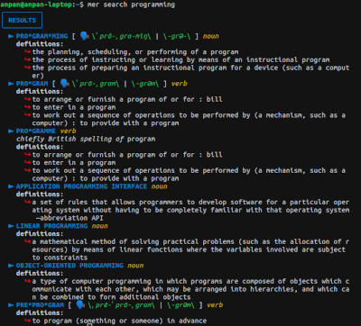

# Mer



Mer is a small dictionary CLI application based on **Merriam-Webster free Collegiate Dictionary API**.

You have to provide your own API key in order to use this app.

Create your own API key for free [here](https://dictionaryapi.com/).

## Installation

This application requires a working Go environment. See the [installation instructions for Go](https://golang.org/doc/install).

If you already have a working Go environment, you can use the command below.

```bash
$ go get -u github.com/ideaspaper/mer
```

## Usage

- `$ mer` or `$ mer --help`

  Display help.

- `$ mer search [word]`

  Search the meaning of a word. Only accept exactly 1 argument, which is the word you want to search.

- `$ mer key`

  Read your API key from config file.

- `$ mer key [key]`

  Write your API key to config file.

If no `mer_config.env` existed in the binary path yet, those commands will create empty `mer_config.env` instead.